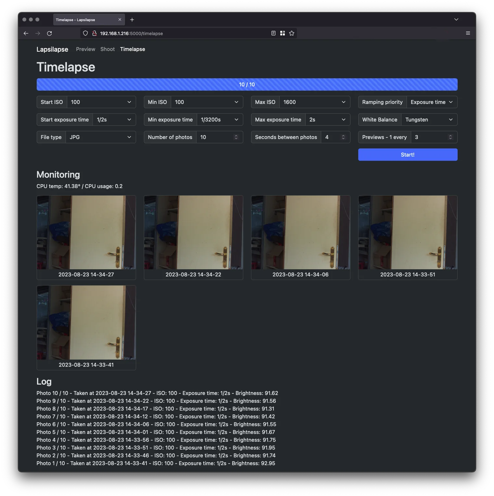

# Lapsilapse
## What's this?
Lapsilapse has been designed to run timelapses and holy grail timelapses on a Raspberry Pi with the official HQ camera and fully controlled via a responsive web interface. It is meant to be run headlessly with no GUI.

It's a tool I've developed for my personal usage so it's still work in progress with known limitations (see below).

Lapsilapse has been tested on a Raspberry Pi 4 with 2 GB RAM and I haven't yet seen any performance issues.

## Screenshots
Timelapse screen:

## Example
A not-so-great example that I'll update at some point:

## How does it work?
Here's a short description of the "happy flow":
- Install Raspberry Pi OS on a large Micro SD card as curently Lapsilapse doesn't support external drives.
- Connect your Pi to a network, or set the Pi as a hotspot.
- Set up Lapsilapse (see below).
- Start Lapsilapse.
- The Preview page allows to focus the lens.
- The Timelapse page sets the timelapse and allows to follow its progress.

## Known limitations
Lapsilapse still has a lot of limitations that will be taken care of at some point:
- Can't use an external drive for storing the timelapse's files.
- The Shoot page, which allows taking single photos, is not fully developed yet e.g. settings are not effective.

## Evolutions
I already have a list of evolutions to implement:
- Allow to change basic settings in Preview mode.
- Finish the Shoot page.
- Have the possibility to use external drives.
- Improve the Holy Grail process - the current system is a very first version, that needs to be enhanced.
- Run on a prod ready server e.g. gunicorn.

## Setup
To setup Lapsilapse:
- Clone this repo
- Create a venv with `python -m venv .venv`
- Activate the venv with `. .venv/bin/activate`
- Run `python -m pip install -r requirements.txt` to install the dependencies.
- Set the env var `export FLASK_APP=server.py`
- Run the server with `flask run --host=0.0.0.0`

## Licence
MIT License.